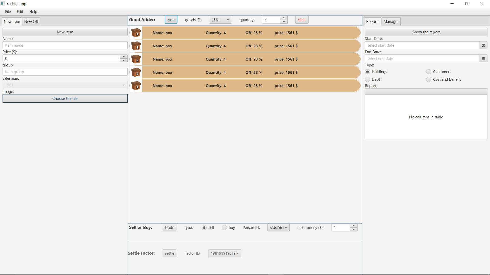

# JavaFX Inventory Management Application

### Overview
This is a Inventory Management Application developed using Java and JavaFX. The application is designed to streamline the process of managing inventory for small to medium-sized businesses, providing features for defining new items and customers. It includes distinct roles for managers and cashiers, thus ensuring organized operations. Additionally, it offers reporting capabilities that help monitor business activities effectively.



### Features
- **Product Management**: Add and manage product items in your inventory.
- **Customer Management**: Keep track of your customer data effortlessly.
- **Role-Based Access**: Distinct access and operations for managers and cashiers.
- **Reporting**: Get detailed reports on your inventory status, sales, and more.

### Installation
Ensure that you have Java and JavaFX set up on your system before proceeding with the installation.

1. Clone the repository to your local machine
```console
git clone https://github.com/kiasar/JavaFX_Market_App_uI
```
2. Navigate to the cloned repository.
```console
cd JavaFX_Market_App_uI
```
3. Run the application.
```console
java -jar <path_to_compiled_jar>
```

### Usage
After launching the application, log in with your credentials. Depending on your role (manager or cashier), you will be directed to different interfaces, each with specific functionalities. 
1. **Manager Interface**:
	- Add, update, or remove products from the inventory.
	- Add or update customer details.
	- View various reports to monitor business activities.
2. **Cashier Interface**:
	- Process sales transactions.
	- Generate invoices for customers.
	- View products in the inventory.

### License
This project is licensed under the MIT License. Please see the LICENSE file for details.
